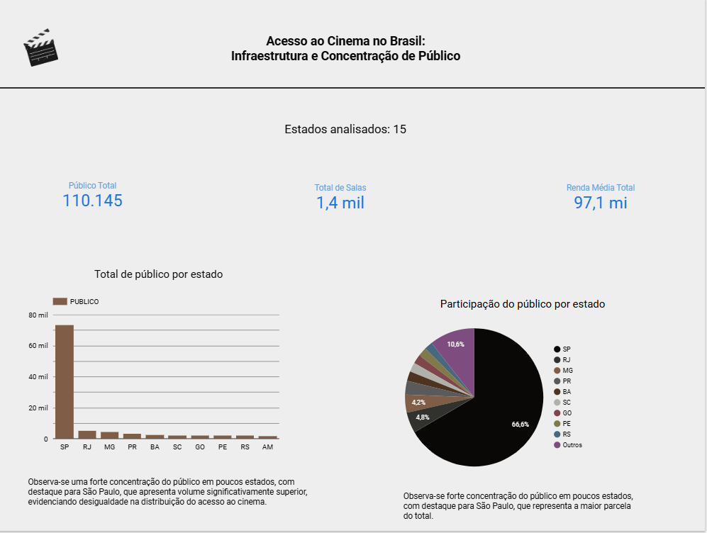
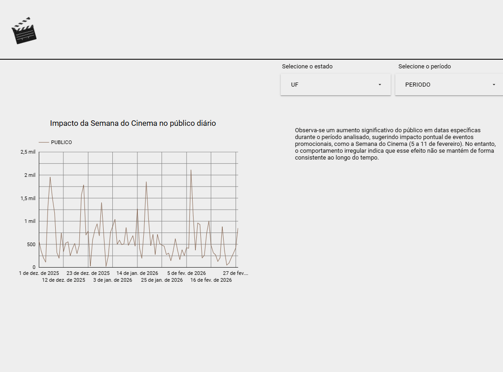
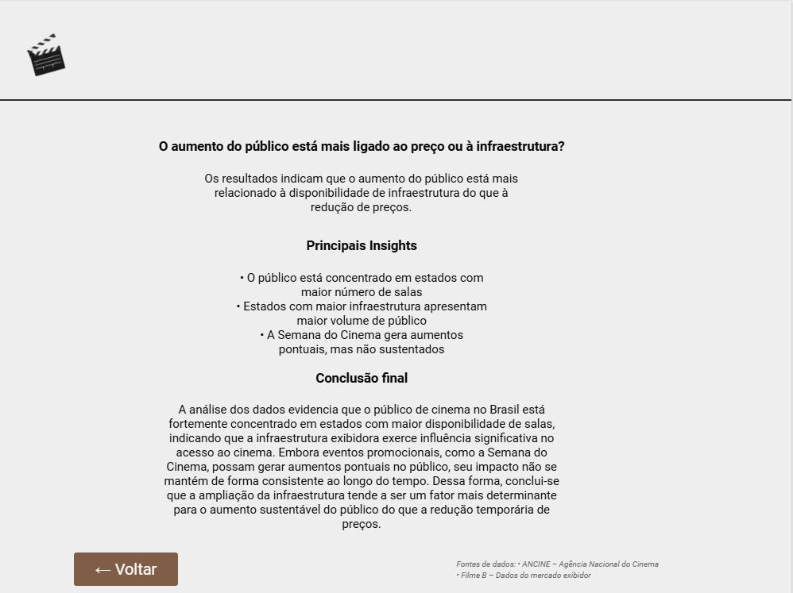

# 🎬 Análise do Mercado Cinematográfico Brasileiro

Este projeto investiga os fatores que influenciam o acesso ao cinema no Brasil, com foco na relação entre infraestrutura (número de salas), indicadores econômicos e o público.

---

## 📊 Problema

O aumento do público no cinema está mais relacionado à redução do preço dos ingressos ou à disponibilidade de infraestrutura?

---

## 🗂️ Dados utilizados

- ANCINE – dados de exibição cinematográfica  
- Filme B – rankings de público e renda por estado  

---

## ⚙️ Processamento dos dados

- Limpeza e padronização dos dados  
- Integração entre diferentes fontes  
- Tratamento de valores nulos  
- Criação de variáveis derivadas  
- Análise exploratória com PySpark  

---

## 📈 Dashboard

O dashboard foi desenvolvido no Looker Studio e dividido em três páginas:

- Visão geral  
- Semana do Cinema  
- Conclusão e Insights

🔗 [Acessar dashboard] (https://datastudio.google.com/reporting/e4a052fe-4f5c-439d-801f-35e8582d7c3f/page/MgcvF)

---

## 📸 Preview do Dashboard

### Visão Geral

### Semana do Cinema

### Conclusão e Insights

---

## 🔍 Principais Insights

- O público está concentrado em estados com maior número de salas  
- A infraestrutura influencia diretamente o acesso ao cinema  
- Eventos promocionais geram impactos pontuais, mas não são sustentados

---

## ✅ Conclusão

O aumento do público está mais relacionado à disponibilidade de infraestrutura do que à redução de preços.

---

## 📄 Documentação completa

[📥 Baixar documentação](docs/documentacao_projeto.pdf)

---

## 🛠️ Tecnologias utilizadas

- Python  
- PySpark  
- Google Colab  
- Looker Studio  

---

## 👩‍💻 Autora

Mara Alonso
